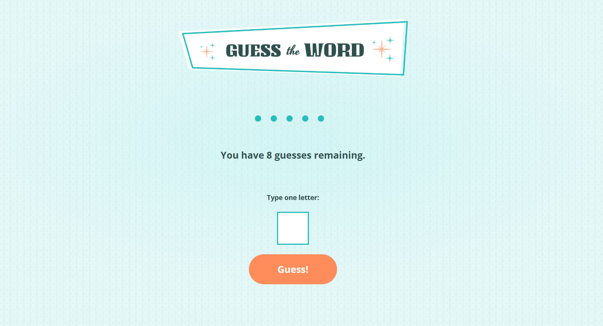

# Guess-the-Word-Game

- [Overview](#overview)
  - [Screenshot](#screenshot)
  - [Links](#links)
- [My process](#my-process)
  - [Built with](#built-with)
  - [What I learned](#what-i-learned)
  - [Continued development](#continued-development)
  - [Useful resources](#useful-resources)
- [Author](#author)
- [Acknowledgments](#acknowledgments)

## Overview
- Players guess the word by entering one letter at a time. If the player guesses all the letters correctly before they use up their allotted guesses, they win!

### Screenshot

### Links
- Solution URL:
 https://github.com/Dev-Wy/Guess-the-Word-Game/
- Live Site URL:
 https://dev-wy.github.io/Guess-the-Word-Game/

## My Process
### Built with
- JavaScript
- Manipulate the DOM

### What I learned
- I learned how to manipulate the DOM and enhance my Vanilla JavaScript skills. I also became familiar randomizing within JS functions.

### Continued development
- I would like to add hitting the "Enter" or "Return" key as a way to contribute an answer. 

### Useful Resources: 
- I love W3C School's validation services. 
- https://validator.w3.org/   
- https://jigsaw.w3.org/css-validator/

## Author
- Jake Wyant
- Portfolio: https://dev-wy.github.io/Portfolio/
- https://forum.freecodecamp.org/u/dev-wy/summary

## Acknowledgments
- W3C for their resources. 
- Special thanks to Skillcrush for giving me the foundation to build on.
